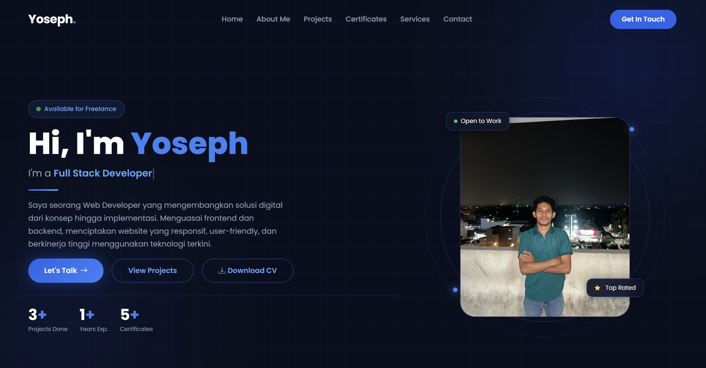

<div align="center">

# Yoseph Kewena Hayon Personal Portfolio

Website portfolio pribadi yang menampilkan profil, project, sertifikat, dan layanan sebagai Web Developer.

[](#)
[](#)
[](#)
[](#)
[](#)
[](#)

[](#)
[](#lisensi)

</div>

---

## Daftar Isi

- [Tentang](#tentang)
- [Preview](#preview)
- [Fitur](#fitur)
- [Teknologi yang Digunakan](#teknologi-yang-digunakan)
- [Struktur Folder](#struktur-folder)
- [Instalasi & Menjalankan Secara Lokal](#instalasi--menjalankan-secara-lokal)
- [Bagian Halaman](#bagian-halaman)
- [Kontak](#kontak)
- [Lisensi](#lisensi)

---

## Tentang

Repository ini berisi source code website portfolio pribadi Yoseph, seorang mahasiswa Teknik Informatika yang fokus pada Web Development. Website dibangun secara responsif dengan pendekatan mobile-first, menampilkan profil, daftar project, sertifikat, layanan yang ditawarkan, hingga form kontak interaktif.

## Preview

<div align="center">
  
</div>

## Fitur

| Fitur             | Deskripsi                                                                |
| ----------------- | ------------------------------------------------------------------------ |
| Hero Section      | Perkenalan diri dengan efek typing text dan statistik singkat            |
| Tentang Saya      | Deskripsi profil, skill, dan pengalaman                                  |
| Portfolio Project | Menampilkan project yang telah dikerjakan lengkap dengan tautan langsung |
| Sertifikat        | Galeri sertifikat dengan modal viewer (PDF dan gambar)                   |
| Layanan           | Daftar jasa yang ditawarkan beserta teknologi terkait                    |
| Form Kontak       | Formulir validasi sisi klien untuk pengiriman pesan                      |
| Responsif         | Tampilan optimal di perangkat desktop, tablet, dan mobile                |

## Teknologi yang Digunakan

<div align="center">

[](#)
[](#)
[](#)
[](#)
[](#)
[](#)
[](#)
[](#)
[](#)
[](#)
[](#)

</div>

**Frontend**

- **HTML5** — struktur semantik halaman
- **CSS3** — custom styling (`style.css`)
- **JavaScript (Vanilla)** — logika interaktif (`script.js`)
- **Bootstrap 5.3.3** — grid system dan komponen UI
- **Bootstrap Icons 1.11.3** — ikon pada seluruh bagian halaman
- **Google Fonts (Poppins)** — tipografi utama

**Tools & Version Control**

- **Git** — sistem version control
- **GitHub** — hosting repository dan kolaborasi kode

> **Catatan:** repository ini adalah website statis murni (HTML/CSS/JS) tanpa proses build.
> Laravel, PHP, dan MySQL merupakan bagian dari skill yang ditampilkan di halaman **Services**,
> bukan teknologi yang dipakai untuk membangun website portfolio ini.

## Struktur Folder

```
Portfolio/
├── index.html          # Seluruh halaman (single page) — semua section ada di sini
├── style.css           # Custom styling, tema gelap, dan media query responsif
├── script.js           # Typing effect, scroll animation, navbar, form, modal sertifikat
├── README.md
├── HAKI.pdf
├── images/             # Foto profil, hero, dan thumbnail project
│   ├── hero.jpg
│   ├── me.jpg
│   ├── Yoseph.jpg
│   ├── Yoseph Kewena.jpeg
│   ├── bengkel.jpg
│   ├── SneakHub.jpg
│   └── rmsaungtiga.jpg
└── sertifikat/         # Berkas sertifikat (PDF & gambar) yang dibuka lewat modal
    ├── dicoding_dasar_ai.pdf
    ├── dicoding_pemula.pdf
    ├── dicoding_python.pdf
    ├── Introduction to Java.jpg
    ├── Java Intermediate.jpg
    ├── PKM.pdf
    └── HAKI.pdf
```

## Instalasi & Menjalankan Secara Lokal

Tidak ada dependency yang perlu di-install dan tidak ada proses build — cukup clone lalu buka.

**1. Clone repository**

```bash
git clone https://github.com/yovanhayon-ctrl/Portfolio.git
```

**2. Masuk ke folder project**

```bash
cd Portfolio
```

**3. Jalankan**

Cara paling sederhana adalah membuka `index.html` langsung di browser. Namun sebagian browser
membatasi pemuatan berkas lokal (`file://`) di dalam `<iframe>`, sehingga **preview PDF pada modal
sertifikat bisa gagal tampil**. Karena itu disarankan menjalankan lewat server lokal:

```bash
python -m http.server 5510
```

Lalu buka `http://localhost:5510` di browser.

Alternatif lain: ekstensi **Live Server** di VS Code, atau letakkan folder ini di `htdocs`/`www`
milik XAMPP/Laragon dan akses melalui `http://localhost/Portfolio`.

> Website memuat Bootstrap, Bootstrap Icons, dan Google Fonts dari CDN, jadi diperlukan
> koneksi internet agar tampilan tampil sempurna.

## Bagian Halaman

| Section         | Anchor          | Isi                                                                                        |
| --------------- | --------------- | ------------------------------------------------------------------------------------------ |
| Home            | `#home`         | Hero section, typing effect pada role, dan statistik singkat                                |
| About Me        | `#about`        | Deskripsi profil, skill, dan pengalaman                                                     |
| Projects        | `#projects`     | Web Bengkel Mobil, SneakHub — Toko Online, dan Website Rumah Makan                          |
| Certificates    | `#certificates` | 6 sertifikat (Dicoding, Java, HAKI) yang dibuka lewat modal viewer PDF/gambar               |
| Services        | `#services`     | Website Development, E-Commerce, Responsive Design, Backend, Maintenance, Konsultasi Web    |
| Contact         | `#contact`      | Info kontak dan form pesan dengan validasi sisi klien                                       |

**Catatan mengenai form kontak:** form saat ini hanya melakukan validasi di sisi klien lalu
menampilkan pesan sukses — pesan **belum benar-benar terkirim** ke email atau backend mana pun.
Untuk mengaktifkan pengiriman, hubungkan form ke layanan seperti Formspree, EmailJS, atau
endpoint backend Anda sendiri.

## Kontak

- **Email** — [yovanhayon@gmail.com](mailto:yovanhayon@gmail.com)
- **WhatsApp** — [+62 821 4730 4198](https://wa.me/6282147304198)
- **Instagram** — [@yovanhayon](https://instagram.com/yovanhayon)
- **GitHub** — [yovanhayon-ctrl](https://github.com/yovanhayon-ctrl)

Terbuka untuk freelance & project.

## Lisensi

Dirilis di bawah lisensi [MIT](https://opensource.org/licenses/MIT).

Source code bebas digunakan dan dimodifikasi. Namun konten pribadi di dalamnya — foto, sertifikat,
berkas HAKI, dan data diri — bukan bagian dari lisensi ini dan tidak untuk digunakan kembali.

---

<div align="center">

Dibuat oleh **Yoseph Kewena Hayon**

</div>
